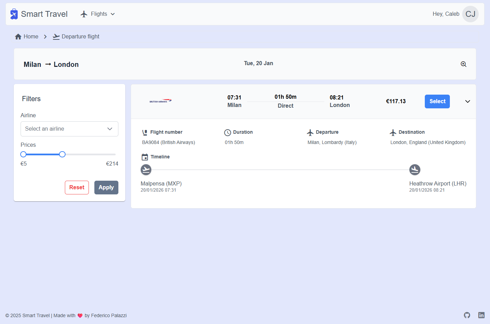
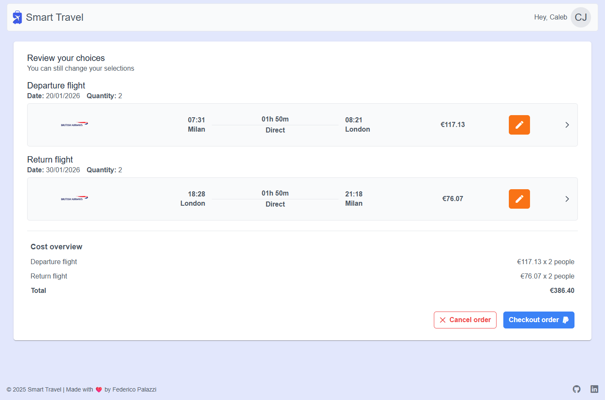
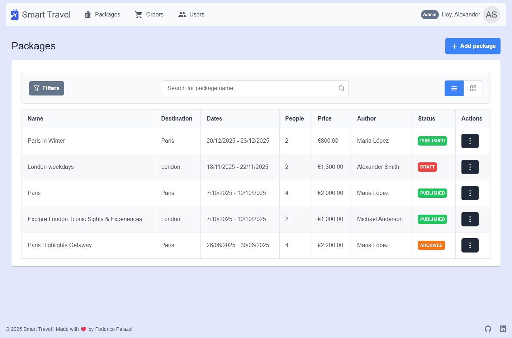
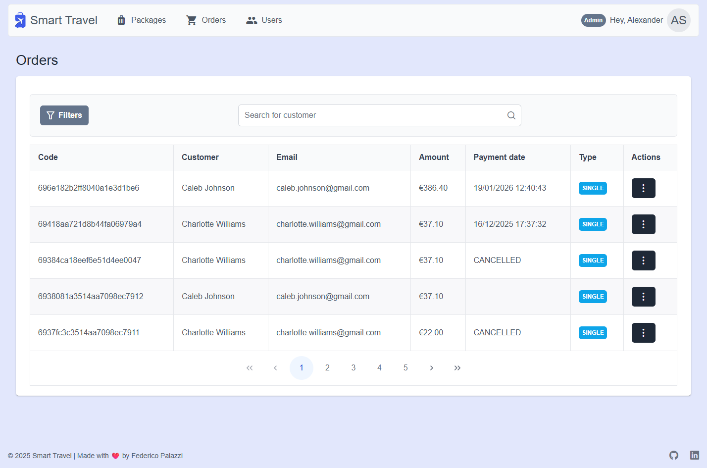
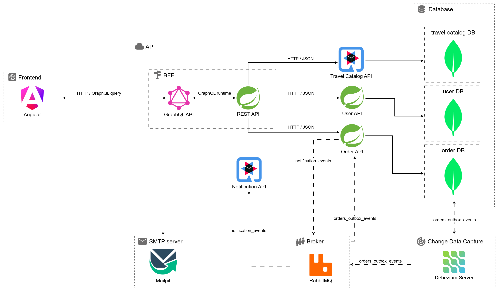
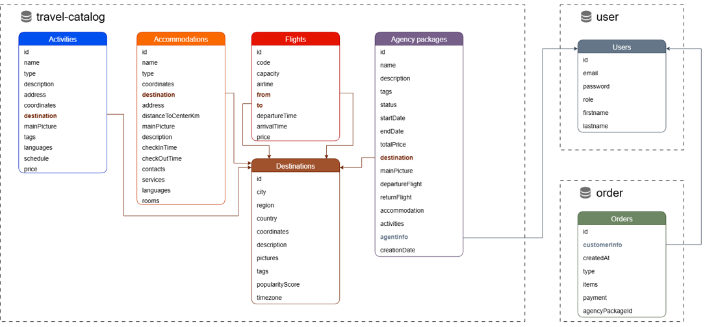
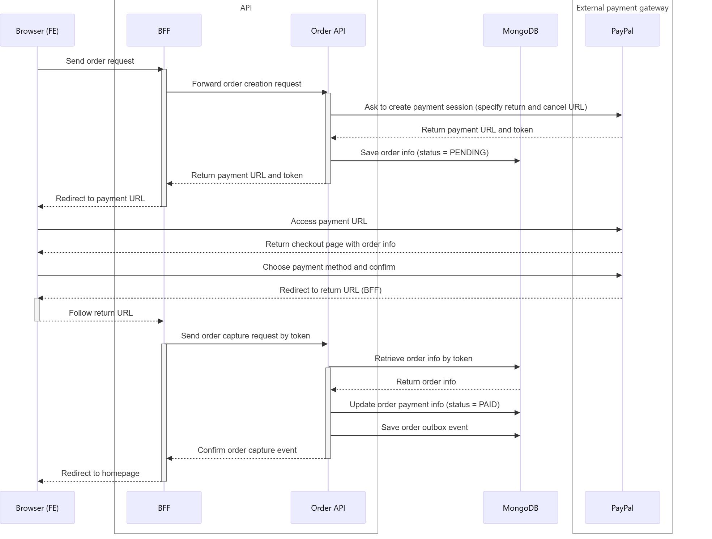
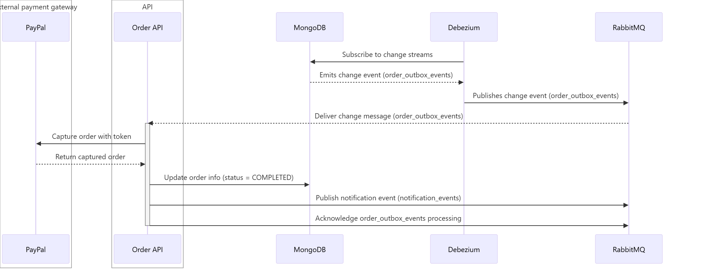

# Smart Travel: Your trip, just a click away

## Introduction

**SmartTravel** is a modern, microservices-based e-commerce application designed for searching and purchasing travel packages, including flights, hotels, and organized tours. The platform is built with a focus on high performance, scalability, and asynchronous communication.

The application handles the entire customer journey, from browsing a public catalog to managing a shopping cart, processing secure payments, and receiving automated notifications. It features a multi-role system supporting **Customers**, **Travel Agents** (for catalog management), and **Administrators** (for user management).

## Architecture

The system follows a cloud-native **Microservices Architecture** to ensure modularity and independent scalability:

* **BFF (Backend-for-Frontend):** A dedicated layer using **GraphQL** that acts as the single entry point for the frontend, optimizing data fetching and reducing over-fetching.
* **Event-Driven Communication:** Asynchronous messaging via **RabbitMQ** ensures decoupled services. For example, order creation triggers notification events without blocking the main process.
* **Transactional Outbox Pattern:** Uses **Debezium** for Change Data Capture (CDC) to ensure reliable event publishing from the database to the message broker.

## Technology Stack

### **Backend**

* **Frameworks:** Java with **Spring Boot** (for User and Order services) and **Quarkus** (for Travel Catalog and Notification services).
* **APIs:** REST (microservices) and **GraphQL** (exposed by BFF to frontend).

### **Frontend**

* **Framework:** **Angular**.
* **UI Components:** **PrimeNG** for a responsive and professional user interface.
* **State Management:** **RxJS** for reactive data handling.

### **Data & Messaging**

* **Database:** **MongoDB** (NoSQL) for flexible storage of multilingual travel descriptions and variable destination details.
* **Message Broker:** **RabbitMQ**.

### **DevOps & Infrastructure**

* **CI/CD:** Automated pipelines built with **Jenkins**.
* **Containerization:** **Docker** for service isolation.
* **Orchestration:** **OKD (OpenShift Kubernetes Distribution)** for managing deployment, scaling, and networking.

## Microservices Breakdown

1. **User Service (Spring Boot):** Handles registration, login, and profile management.
2. **Travel Catalog Service (Quarkus):** Manages package information, pricing, and availability.
3. **Order & Payment Service (Spring Boot):** Manages the checkout flow and integrates with external providers like **PayPal**.
4. **Notification Service (Quarkus):** Sends automated email confirmations via **Mailpit** upon successful orders.

## Database Structure

## Payment Flow

### Order creation

### Order capture

### Email notification

## Future Roadmap

* **Reviews System:** Allowing customers to rate and review their trips.
* **Map Integration:** Visualizing accommodations and activities via geolocation services.
* **Push Notifications:** Real-time updates for mobile and web users.
* **Multi-currency Support:** Full internationalization for global users.

## Credentials

### User credentials
~~~
CUSTOMER
email                               password
caleb.johnson@gmail.com             12345
charlotte.williams@gmail.com        12345

AGENT
email                               password
maria.lopez@smart-travel.com        12345
michael.anderson@smart-travel.com   12345

ADMIN
email                               password
alexander.smith@smart-travel.com    12345
amelia.thompson@smart-travel.com    12345
~~~

### PayPal

~~~
email:      g15-personal@wa2.polito.it
password:   bellapass
~~~

