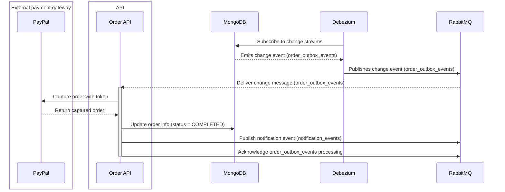

```mermaid

sequenceDiagram
    %%%%%%%%%%%%%%%%%%
    %% Participants %%
    %%%%%%%%%%%%%%%%%%

    box External payment gateway
        participant PP as PayPal
    end

    box API
        participant ORD as Order API
    end
    participant DB as MongoDB

    participant DEB as Debezium

    participant RAB as RabbitMQ

    %%%%%%%%%%%%%%%%%%
    %% Interactions %%
    %%%%%%%%%%%%%%%%%%

    DEB->>DB: Subscribe to change streams
    DB-->>DEB: Emits change event (order_outbox_events)

    DEB->>RAB: Publishes change event (order_outbox_events)
    RAB-->>ORD: Deliver change message (order_outbox_events)
    activate ORD

    ORD->>PP: Capture order with token
    PP-->>ORD: Return captured order
    ORD->>DB: Update order info (status = COMPLETED)
    ORD->>RAB: Publish notification event (notification_events)
    ORD->>RAB: Acknowledge order_outbox_events processing
    deactivate ORD
```
