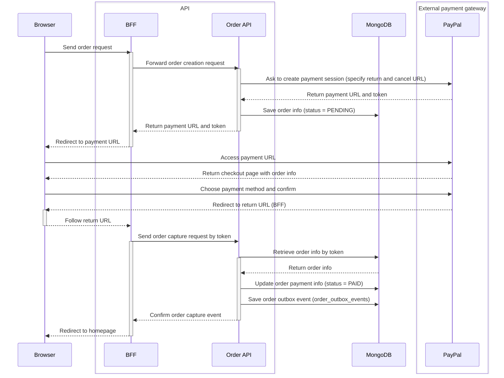

```mermaid
sequenceDiagram
    %%%%%%%%%%%%%%%%%%
    %% Participants %%
    %%%%%%%%%%%%%%%%%%
    participant FE as Browser

    box API
        participant BFF
        participant ORD as Order API
    end

    participant DB as MongoDB

    box External payment gateway
        participant PP as PayPal
    end


    %%%%%%%%%%%%%%%%%%
    %% Interactions %%
    %%%%%%%%%%%%%%%%%%

    %%% 1st phase: Order creation %%%

    FE->>BFF: Send order request

    activate BFF
    BFF->>ORD: Forward order creation request

    activate ORD
    ORD->>PP: Ask to create payment session (specify return and cancel URL)
    PP-->>ORD: Return payment URL and token
    ORD->>DB: Save order info (status = PENDING)
    ORD-->>BFF: Return payment URL and token
    deactivate ORD

    BFF-->>FE: Redirect to payment URL
    deactivate BFF

    %%% 2nd phase: Order payment %%%
    FE->>PP: Access payment URL
    PP-->>FE: Return checkout page with order info
    FE->>PP: Choose payment method and confirm
    PP-->>FE: Redirect to return URL (BFF)

    %%% 3rd phase: Order capture %%%
    activate FE
    FE-->>BFF: Follow return URL
    deactivate FE

    BFF->>ORD: Send order capture request by token
    activate BFF
    ORD->>DB: Retrieve order info by token
    activate ORD
    DB-->>ORD: Return order info
    ORD->>DB: Update order payment info (status = PAID)
    ORD->>DB: Save order outbox event (order_outbox_events)
    ORD-->>BFF: Confirm order capture event
    deactivate ORD

    BFF-->>FE: Redirect to homepage

    deactivate BFF
```
