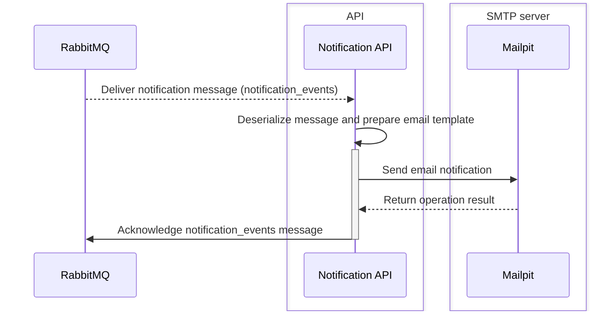

```mermaid

sequenceDiagram
    %%%%%%%%%%%%%%%%%%
    %% Participants %%
    %%%%%%%%%%%%%%%%%%

    participant RAB as RabbitMQ

    box API
        participant NOT as Notification API
    end

    box SMTP server
        participant MP as Mailpit
    end

    %%%%%%%%%%%%%%%%%%
    %% Interactions %%
    %%%%%%%%%%%%%%%%%%

    RAB-->>NOT: Deliver notification message (notification_events)
    NOT->>NOT: Deserialize message and prepare email template
    activate NOT
    NOT->>MP: Send email notification
    MP-->>NOT: Return operation result
    NOT->>RAB: Acknowledge notification_events message
    deactivate NOT

```
